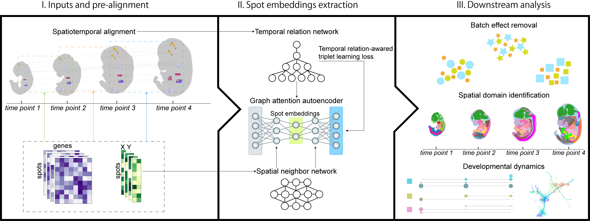

# STIFT: Spatiotemporal Integration Framework for Transcriptomics

## Overview



Overview of STIFT. STIFT first uses developmental spatiotemporal optimal transport to establish probabilistic mappings between spots across consecutive time points using the gene expression information and spatial coordinates information of all slices. Second, it simultaneously constructs a spatial neighbor network using the spatial coordinates information within each slice and a temporal relation network from the probabilistic mappings. Third, it integrates these two networks to construct a spatiotemporal graph. Finally, it takes the spatiotemporal graph and gene expression information to Graph Attention Autoencoder (GATE) with triplet learning informed by temporal relations to generate integrated embeddings that preserve both spatial organization and developmental trajectories. After integrating large-scale spatiotemporal transcriptomics data, STIFT subsequently enables batch effect removal, spatial domain identification, and exploration of developmental dynamics during developmental and regenerative processes.

## Installation

### Clone the repository

```
git clone https://github.com/TheLittleJimmy/STIFT.git
cd STIFT
```

### Create new environment

```
#create an environment called env_STAligner
conda create -n env_STIFT python=3.9.19

#activate your environment
conda activate env_STIFT
```

### Install required packages

```
pip install -r requirements.txt
```

### Install STIFT

```
pip install .
```

## Tutorial

[Tutorial](https://github.com/TheLittleJimmy/STIFT/blob/main/tutorial/tutorial_ARTISTA_integration.ipynb) provides the basic workflow of STIFT. For more information, please visit [STIFT archive repository](https://github.com/TheLittleJimmy/temporal_alignment). 

## Contact

If there are any questions, please contact the author at qiji@link.cuhk.edu.hk. The author is happy to help!
